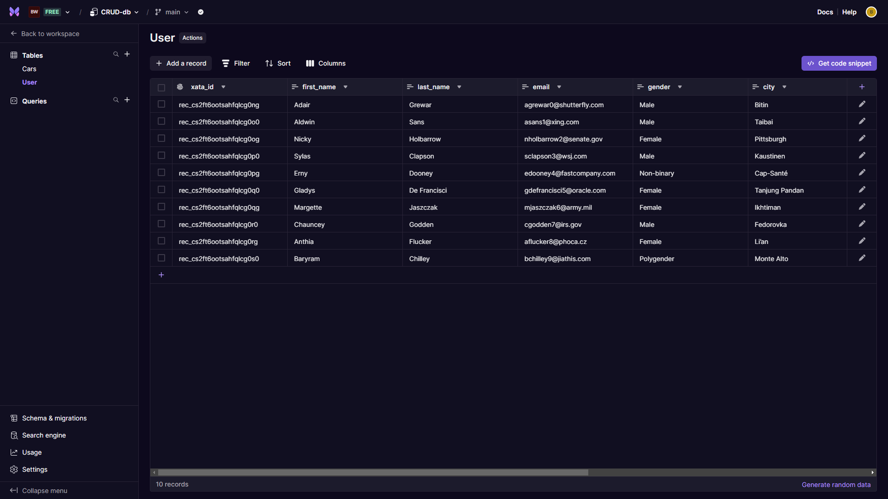

# CRUD Operations with Xata Database

This project is a TypeScript application that uses the Xata database. The project structure includes configuration files, source code, and database migration files.

## Database Setup

The project uses the Xata database, which is configured in the `src/server.ts` file. The database connection is established using the `@xata.io/client` package.

## Database Diagram

Here is a diagram of the database schema:

## Project Structure

The project is organized into the following directories:

* `src`: Source code for the application
* `config`: Configuration files for the application
* `migrations`: Database migration files

## Dependencies

The project uses the following dependencies:

* `@xata.io/client`: Xata database client
* `express`: Web framework
* `cors`: CORS middleware
* `dotenv`: Environment variable management
* `morgan`: Logging middleware

## Scripts

The project includes the following scripts:

* `start`: Starts the application in production mode
* `build`: Builds the application using the TypeScript compiler
* `dev`: Starts the application in development mode using nodemon

