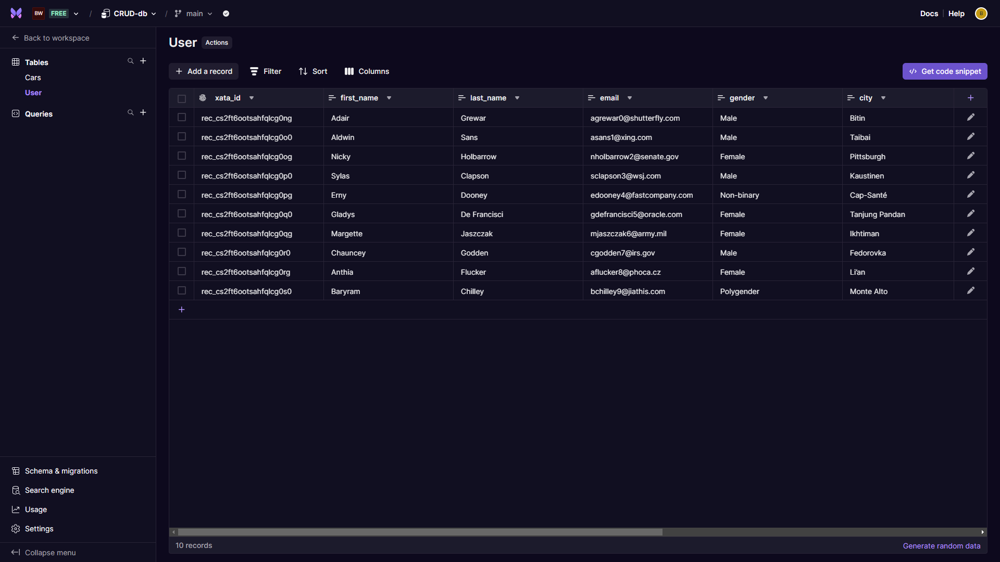

# CRUD Operations with Xata Database

Welcome to our TypeScript application that leverages the power of the Xata database! This project is designed to provide a robust and scalable solution for managing your data with ease.

## Database Setup

Setting up the database is a breeze with Xata. The configuration is handled in the [`src/server.ts`](src/server.ts) file, where we establish a connection using the `@xata.io/client` package.

## Database Diagram

Visualize your data structure with our comprehensive database schema diagram:


## Project Structure

Our project is neatly organized into the following directories:

* **`src`**: The heart of our application, containing all the source code.
  * **`middleware`**: Custom middleware for handling errors and other tasks.
    * [`errorHandler.ts`](src/middleware/errorHandler.ts)
  * **`routes`**: Define your application routes here.
    * [`users.ts`](src/routes/users.ts)
  * **`utils`**: Utility functions and helpers.
    * [`logger.ts`](src/utils/logger.ts)
    * [`validationResultHandler.ts`](src/utils/validationResultHandler.ts)
    * [`validators.ts`](src/utils/validators.ts)
  * [`server.ts`](src/server.ts): The main server file.
  * [`xata.ts`](src/xata.ts): Xata database client setup.

* **`config`**: Configuration files for the application.

* **`migrations`**: Database migration files to keep your schema up-to-date.
  * `.ledger`
  * `mig_cs2fgco0ja4ahga39mkg.json`
  * `mig_cs2flio0ja4ahga39mmg.json`
  * `mig_cs2foif6u7tkj2u83v4g.json`
  * `mig_cs2frnf6u7tkj2u83v7g.json`
  * `mig_cs2frs00ja4ahga39mp0.json`
  * `mig_cs2ft5v6u7tkj2u83v8g.json`
  * `version/compatibility.json`

## Dependencies

Our project relies on the following top-notch dependencies:

* `@xata.io/client`: Xata database client
* `express`: Web framework
* `cors`: CORS middleware
* `dotenv`: Environment variable management
* `morgan`: Logging middleware

## Scripts

We've included several handy scripts to streamline your workflow:

* **`start`**: Launches the application in production mode.
* **`build`**: Compiles the application using the TypeScript compiler.
* **`dev`**: Starts the application in development mode with `nodemon` for automatic restarts.

## Getting Started

To get started with the project, follow these steps:

1. **Clone the repository**:
    ```sh
    git clone <repository-url>
    ```

2. **Install dependencies**:
    ```sh
    pnpm install
    ```

3. **Set up environment variables**:
    Create a `.env` file in the root directory and add your environment variables.

4. **Run the application**:
    ```sh
    pnpm run dev
    ```

## Contributing

We welcome contributions! Please read our [contributing guidelines](CONTRIBUTING.md) to get started.

## License

This project is licensed under the MIT License. See the [LICENSE](LICENSE) file for details.

---

Happy coding! 🚀